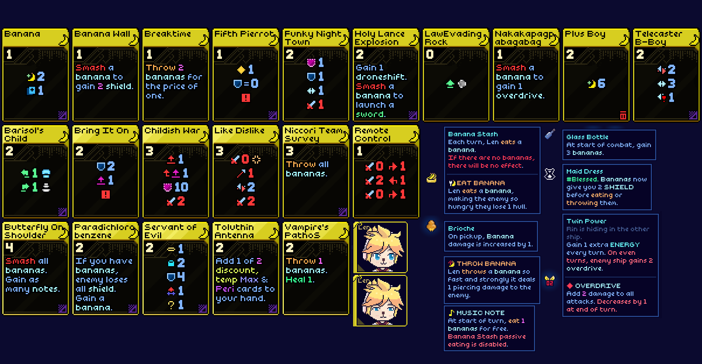
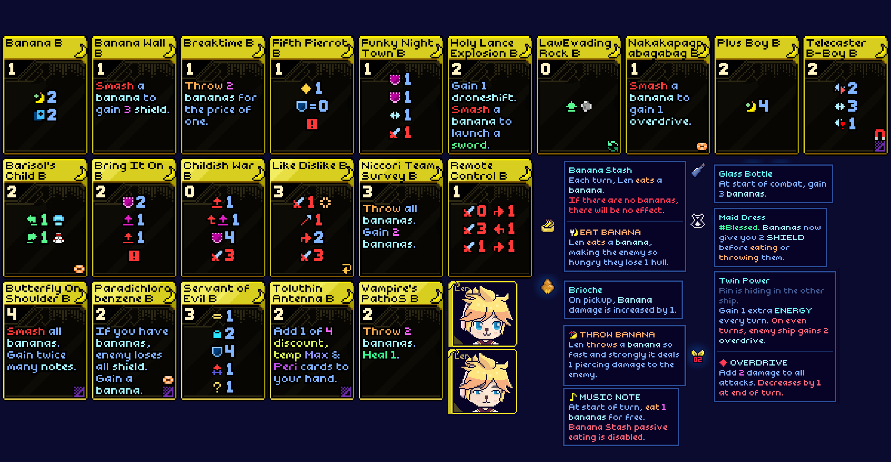

	<h1>Kagamine Len</h1>
	
	
	
What is banana boy doing here?

	
	
Base cards

	
	
Upgrade A cards

	
	
Upgrade B cards

## Dialogue?
I do not plan on making Len dialogue.

## Animations?
I do not plan on making detailed talking animations.

## Other Vocaloid mods?
I do not plan on making other voice bank characters into mods.

## Gameplay Balance
If you find that a card, artifact, concept, etc, could use a tweak, leave a comment in the proper communication channels
- Leave a comment in the NexusMod mod page
- Ping me in the cc-mod-showcase Len Mod thread in the official Rocket Rat Games Discord server
- Open an issue in the GitHub repository

DO NOT:
- Do not ping me in the NexusMods discord server
- Do not ping me in the Thunderstore discord server
- Do not DM me
