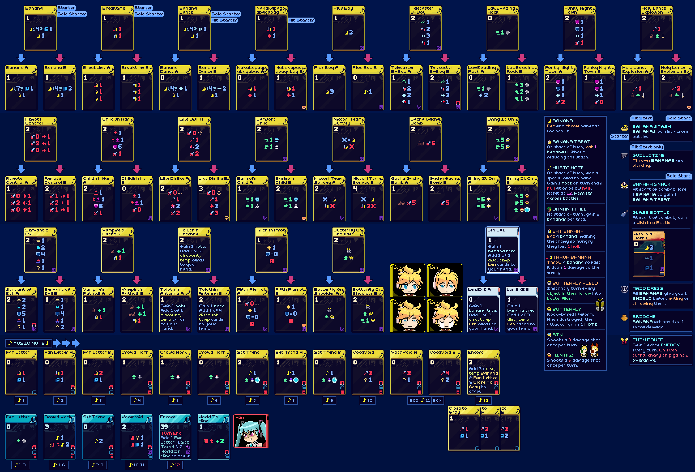

	<h1>Kagamine Len</h1>
	
	
	
	
What is banana boy doing here?

	
	
Complete Overview

# 3.0.0-prerelease

## Kagamine Len, a singer from another Sekai, joins the timeloop!

Being a young genius, he's able to contribute a little bit of everything, from engaging with his Banana system for various effects to simply smacking the enemy with straightforward damage.

To encounter the enemy elite Miku, head over to the mod settings and enable the fight.

If you wish to hear awkward SFX-based music before it's removed, you are free to enable them on the settings too. I do not recommend, as it's not the proper way of handling music snippets.

Features for 3.0.0 release:
* Duo Artifacts?
* Expand barebones dialogue
* Make Miku elite actually fun and balanced instead of whatever it is right now
* Card re-balancing

## See also
* [NexusMods](https://www.nexusmods.com/cobaltcore/mods/8)
* [Release notes](release-notes.md)